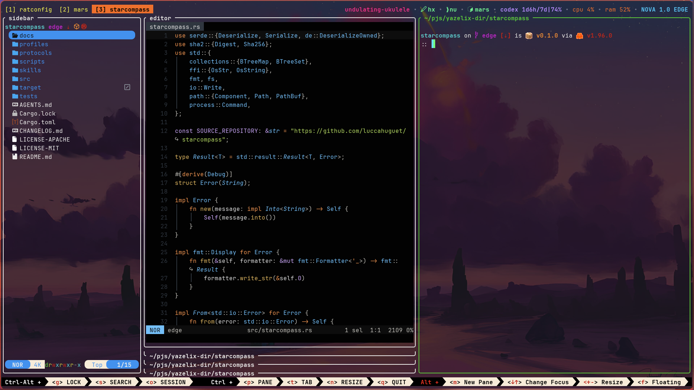

# Yazelix Nova

<div align="center">
  
  <p><strong>Delight is the only option.</strong></p>
</div>

Yazelix Nova is a Nix-packaged terminal workspace built around
[Nova Rio](https://github.com/Yazelix/nova-rio), a minimal
[Zellij PR #5630 distribution](https://github.com/zellij-org/zellij/pull/5630), Yazi, Nushell,
Bash, Zsh, and Fish with Atuin history. It includes a lazygit popup with support
for other Git clients and an optional coding-agent popup.

Yazelix Forest provides the default managed Helix file tree, and the narrow
[Yazelix Radar fork](https://github.com/Yazelix/zj-radar) provides the
collapsible Zellij rail. Nova uses the
[Nova Helix fork](https://github.com/Yazelix/nova-helix) by default;
`editor.command` can select another terminal editor. `yzx launch` opens the
desktop workspace through Rio, while `yzx enter` opens Yazelix in any capable
terminal emulator or over SSH. Great defaults out of the box!

If Yazelix is useful to you,
[support its development on GitHub Sponsors](https://github.com/sponsors/luccahuguet).

**[nova.yazelix.com](https://nova.yazelix.com) is the canonical user guide.**
This README keeps the install and recovery doorway usable when the website is
unavailable; repository documents own source contracts and maintainer detail.



## Install and start

Yazelix requires Nix with flakes enabled. Install the checked Stable release:

```sh
nix profile add --refresh github:Yazelix/nova/stable
```

Open Nova through its packaged Rio terminal:

```sh
yzx launch
```

Enter the same workspace in the current capable terminal or over SSH:

```sh
yzx enter
```

Learn the core workspace keys inside Nova:

```sh
yzx tutor begin
```

If startup fails, inspect Nova's owned runtime without opening Rio or Zellij:

```sh
yzx doctor
```

Linux is the dogfooded platform. Native `aarch64-darwin` builds cover the Rio
packages and Home Manager closure; interactive macOS behavior and the Rio GUI
do not yet have complete release evidence. See the
[installation guide](docs/installation.md) for Main and Edge channels, all
eight package variants, platform evidence, Home Manager, updates, and the
binary cache.

## Documentation

Start with the website:

- [Install and first launch](https://nova.yazelix.com/docs/#start)
- [Features](https://nova.yazelix.com/features/)
- [Configuration](https://nova.yazelix.com/configure/)
- [Keybindings](https://nova.yazelix.com/keybindings/)
- [Updates](https://nova.yazelix.com/update/)
- [Recovery](https://nova.yazelix.com/recover/)

Source and maintainer references stay with the code:

- [Architecture](ARCHITECTURE.md)
- [Runtime contracts](docs/runtime-notes.md)
- [Installation and package reference](docs/installation.md)
- [Development and verification](docs/development.md)
- [Agent-status evidence](docs/agent-status-references.md)
- [Changelog](CHANGELOG.md)

## Development

Enter the pinned development shell, then run the local gates:

```sh
nix develop
nix flake check
nix flake show --all-systems
nix build .#yazelix --no-link --print-build-logs
```

The repository works directly on `edge`. `main` and `stable` receive exact
verified revisions through the promotion process documented in
[Development](docs/development.md#edge-main-and-stable).

Report defects and focused proposals in
[GitHub Issues](https://github.com/Yazelix/nova/issues). Participation follows
the [Code of Conduct](CODE_OF_CONDUCT.md).

## Acknowledgments

Special thanks to [soderluk](https://github.com/soderluk) for sustained reports
through unstable periods of Yazelix.

Special thanks to [tag-und-nacht](https://github.com/tag-und-nacht) for detailed
macOS, Home Manager, theming, and configuration reports.

Special thanks to [TyceHerrman](https://github.com/TyceHerrman) for thorough
macOS and Nix packaging reports that hardened Darwin delivery.

## LOC Scorecard

Yazelix owns **27,003 code/configuration lines** and **5,119 documentation/text
lines**. The [reproducible scorecard](docs/development.md#loc-scorecard)
excludes Beads, lockfiles, and binary assets.
