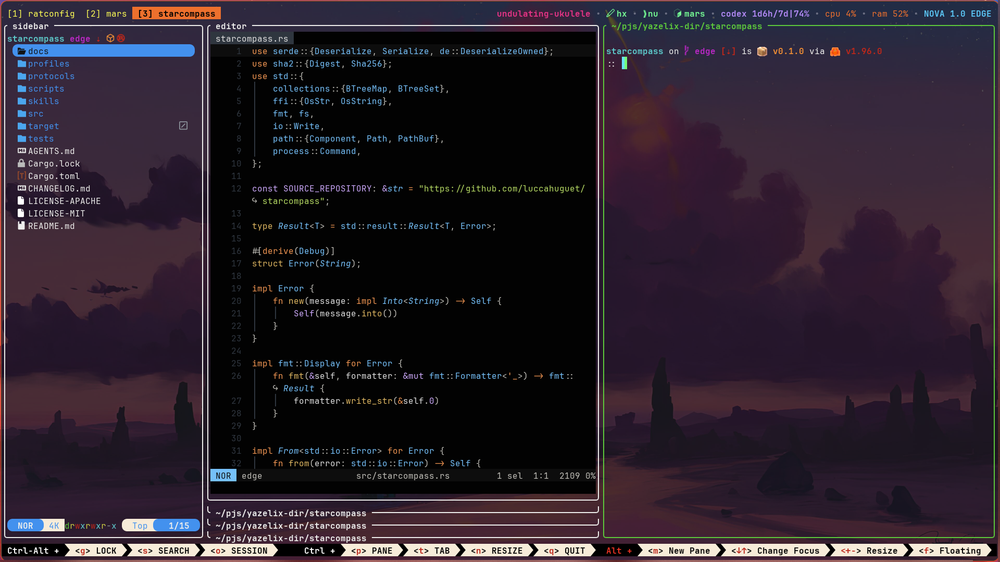

# Yazelix Nova

<div align="center">
  
  <p><strong>Delight is the only option.</strong></p>
</div>

> **The [Nova docs](https://nova.yazelix.com/docs/) are the canonical user guide
> for the current Stable release.** Start there for installation, configuration,
> keybindings, updates, and recovery.

Yazelix Nova is a Nix-packaged terminal workspace built around
[Nova Rio](https://github.com/Yazelix/nova-rio), a minimal
[upstream Zellij distribution](https://github.com/zellij-org/zellij/pull/5630), Yazi, Nushell,
Bash, Zsh, and Fish with Atuin history. It includes a lazygit popup with support
for other Git clients and an optional coding-agent popup.

Yazelix Forest provides the default managed Helix file tree, and the narrow
[Yazelix Radar fork](https://github.com/Yazelix/zj-radar) provides the
collapsible Zellij rail. Nova uses the
[Nova Helix fork](https://github.com/Yazelix/nova-helix) by default;
`editor.command` can select another terminal editor. `yzx launch` opens the
desktop workspace through Rio, while `yzx enter` opens Yazelix in any capable
terminal emulator or over SSH. Great defaults out of the box!

If Yazelix is useful to you,
[support its development on GitHub Sponsors](https://github.com/sponsors/luccahuguet).



## Install and start

Yazelix requires Nix with flakes enabled. Install the checked Stable release:

```sh
nix profile add --refresh github:Yazelix/nova/stable
```

Open Nova through its packaged Rio terminal:

```sh
yzx launch
```

Enter the same workspace in the current capable terminal or over SSH:

```sh
yzx enter
```

Learn the core workspace keys inside Nova:

```sh
yzx tutor begin
```

To try the split work area, open a second work pane with `Alt m`, then press
`Alt ]` or `Alt [` to switch between the stacked and split arrangements. The
Radar sidebar stays open or collapsed as you left it. The command palette's
`layout` entry remains available with `Alt Shift M`.

`Alt Shift B` or **Toggle bottom hints** in the command palette hides or restores
bottom hint rows throughout the current session. Hiding them frees one row for
work panes; sidebar and layout switches retain the choice. New tabs inherit it,
and fresh sessions start with hints visible unless `bottom_hints.start_hidden`
is `true`. Attaching preserves the session's current choice. Toggling preserves pane order,
including manually rearranged stacks and splits.
Open managed popups resize with the hint row, preserving their running process
and keyboard focus.
Set `keybindings.bottom_hints` to remap the shortcut, or `false` to disable it.
The hint row uses compact `C`, `C-A`, `A` and `A-S` modifier headers. Core
workspace and Nova shortcuts take priority as the terminal narrows; managed
hints follow shortcut remapping and disabling. `C-A hl/jk move` groups tab
movement with `h/l` and vertical pane movement with `j/k`.
Alt-Shift hints keep menu first, followed by fullscreen, hints and the HJKL shortcuts.

If startup fails, inspect Nova's owned runtime without opening Rio or Zellij:

```sh
yzx doctor
```

Linux is the dogfooded platform. Native `aarch64-darwin` builds cover the Rio
packages and Home Manager closure; interactive macOS behavior and the Rio GUI
do not yet have complete release evidence. Use the
[website install guide](https://nova.yazelix.com/docs/#start) for Stable setup.
The [repository installation reference](docs/installation.md) covers Main and
Edge channels, all eight package variants, platform evidence, Home Manager,
updates, and the binary cache.

`yzx` is the sole public CLI: `yzx launch`, `yzx enter`, and `yzx help`.
The product name is Yazelix Nova; packages do not install a `nova` command.

## Documentation

The website holds the user guides:

- [Install and first launch](https://nova.yazelix.com/docs/#start)
- [Features](https://nova.yazelix.com/features/)
- [Configuration](https://nova.yazelix.com/configure/)
- [Keybindings](https://nova.yazelix.com/keybindings/)
- [Updates](https://nova.yazelix.com/update/)
- [Recovery](https://nova.yazelix.com/recover/)

Source, Edge, and maintainer references stay with the code:

- [Architecture](ARCHITECTURE.md)
- [Runtime contracts](docs/runtime-notes.md)
- [Installation and package reference](docs/installation.md)
- [Development and verification](docs/development.md)
- [Contributing](CONTRIBUTING.md)
- [Agent-status evidence](docs/agent-status-references.md)
- [Changelog](CHANGELOG.md)

## Development

Enter the pinned development shell, then run the local gates:

```sh
nix develop
nix flake check
nix flake show --all-systems
nix build .#yazelix --no-link --print-build-logs
```

The repository works directly on `edge`. `main` and `stable` receive exact
verified revisions through the promotion process documented in
[Development](docs/development.md#edge-main-and-stable).

Report defects and focused proposals in
[GitHub Issues](https://github.com/Yazelix/nova/issues). Participation follows
the [Code of Conduct](CODE_OF_CONDUCT.md).

## Acknowledgments

Special thanks to [soderluk](https://github.com/soderluk) for sustained reports
through unstable periods of Yazelix.

Special thanks to [tag-und-nacht](https://github.com/tag-und-nacht) for detailed
macOS, Home Manager, theming, and configuration reports.

Special thanks to [TyceHerrman](https://github.com/TyceHerrman) for thorough
macOS and Nix packaging reports that hardened Darwin delivery.

## LOC Scorecard

Yazelix owns **29,228 code/configuration lines** and **5,537 documentation/text
lines**. The [reproducible scorecard](docs/development.md#loc-scorecard)
excludes Beads, lockfiles, and binary assets. The native pane-order correction
and stronger interaction check account for the 61-line code/configuration growth.
Agent guidance covers full-launcher startup, socket-path limits, cache isolation,
ordered-pane regressions and historical build artifact identity.
The startup-picker check uses physical keys and waits for the intended tab's
completed handoff or rejected-open notification before continuing.
Its control commands share a writable isolated cache and short socket directory;
timeout reports include the last screen to distinguish input from cleanup stalls.
Documentation covers macOS XDG opt-in and one config source shared between
explicit host and Nova destinations.
The sole `yzx` CLI removes alias packaging and compatibility-help logic. Its
checks protect the executable namespace, global help, managed PATH and child
argument/output/exit status.
The bottom-hint startup preference adds configuration, layout propagation and
session regression checks; the native background controller keeps the choice
across tab closure and consumes its initial value once.
Product checks use Rust with a shared headless tmux driver; Python remains in
GitHub automation. Preserving the native scenarios increases check source lines
while removing their Python build input.
